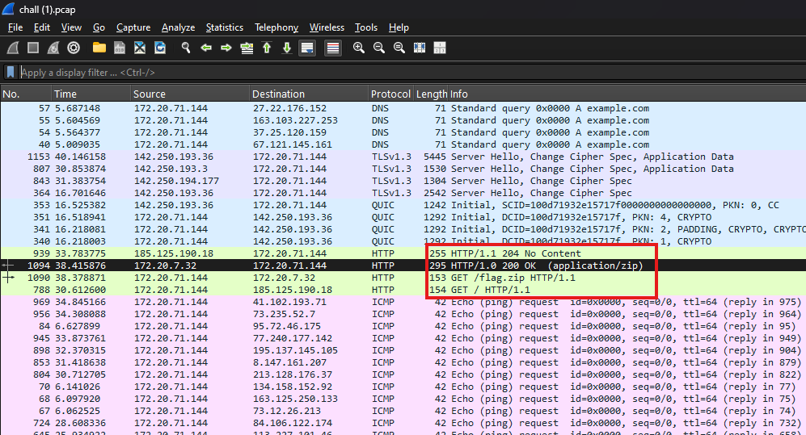
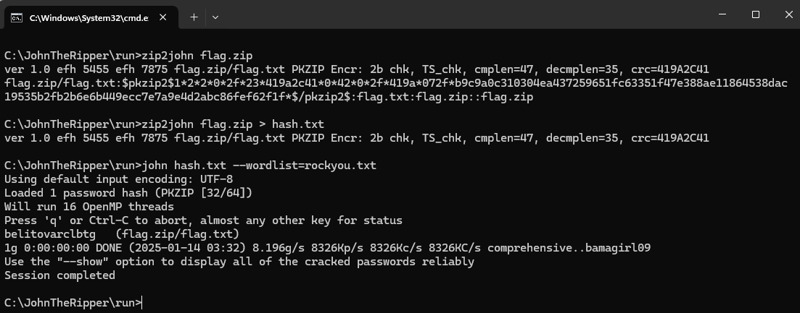

## Description

During an investigation, we intercepted a suspicious stream of network traffic. The attacker managed to exfiltrate a highly confidential file and secured it with a password. The key may be closer than you think **ROCK** your way through it!

## Given Files

[Get the pcap file](./Cracking_the_Stream/chall.pcap)

## Solution

I opened the given file in Wireshark and found that the flag.zip is in the HTTP Stream.

I then exported the flag.zip file from the HTTP Stream.

When tried to extract files from the flag.zip, it asks for a password.
The description uses ROCK hinting at ROCKYOU.txt 
I used John-The-Ripper to crack the password.

I used this password to extract the zip file.
The zip file contained a txt file with the flag.

## Flag

WannaHack{F0ll0w_7he_H77P_S7ream5}
