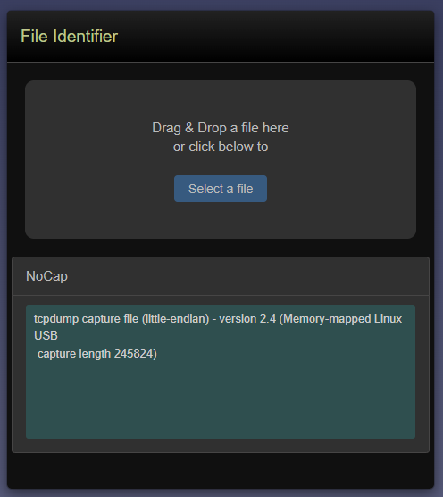
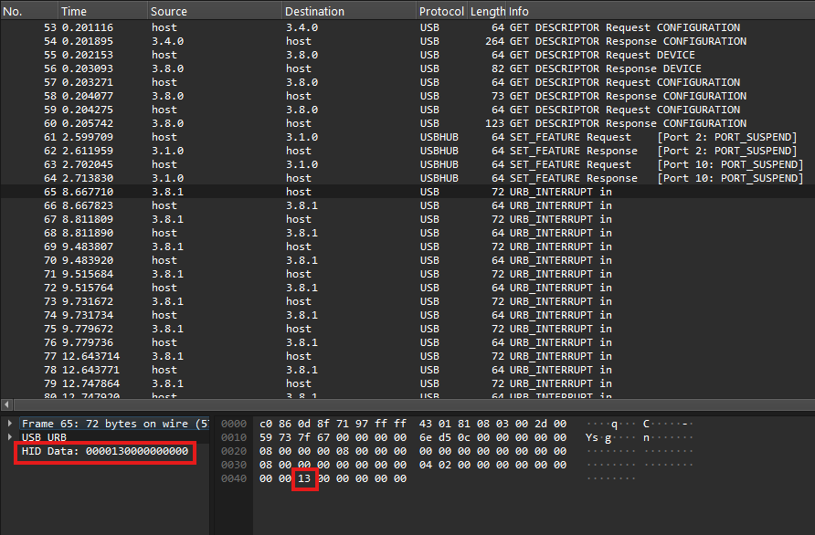
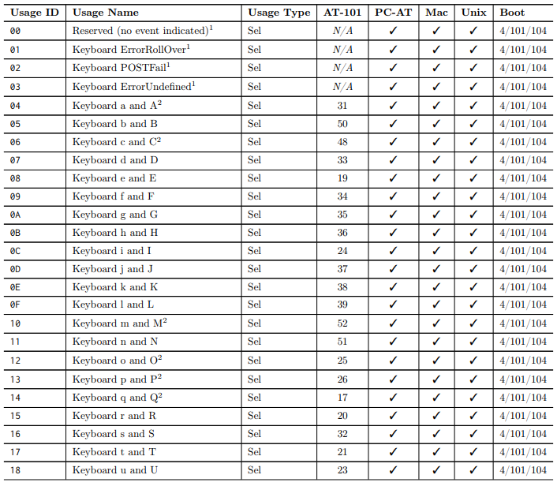
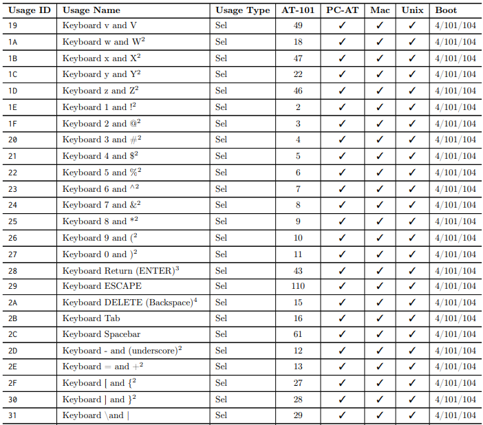
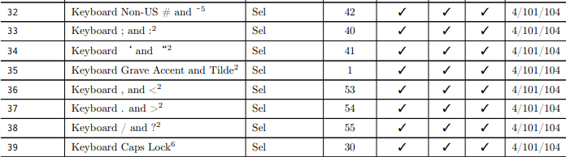
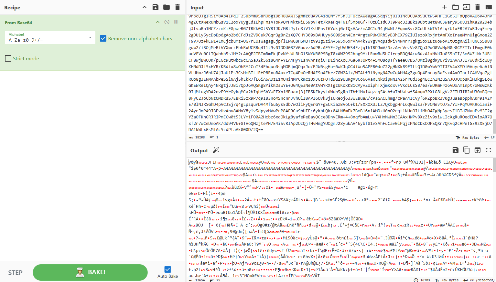
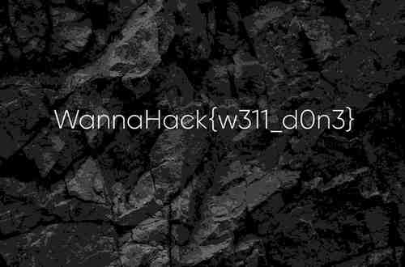

## Description
Someone plugged in a USB device and tried to hack their way past the security. What they didn’t realize was that the device was a trap — a final test to see if you have the skills to defeat the system.

## Given Files

## Solution
The given file did not have any extension/format.
Found the file format using a [website](https://www.toolsley.com/file.html)

Upon analyzing the file, found that the USB Device was a keyboard.

Compared the HID Data from USB Protocol to Usage ID for Key Codes .

 Upon comparing, I got this string - pastebincom/EVGhtqKQ

This clearly indicates a link to a [website](https://pastebin.com/EVGhtqKQ).

Got a string which looked like encoded in Base 64.

Used [cyberchef](https://gchq.github.io/CyberChef/) to decode and save the decoded file.

The decoded file was an image with the flag (above).

## Flag
WannaHack{w311_d0n3}
