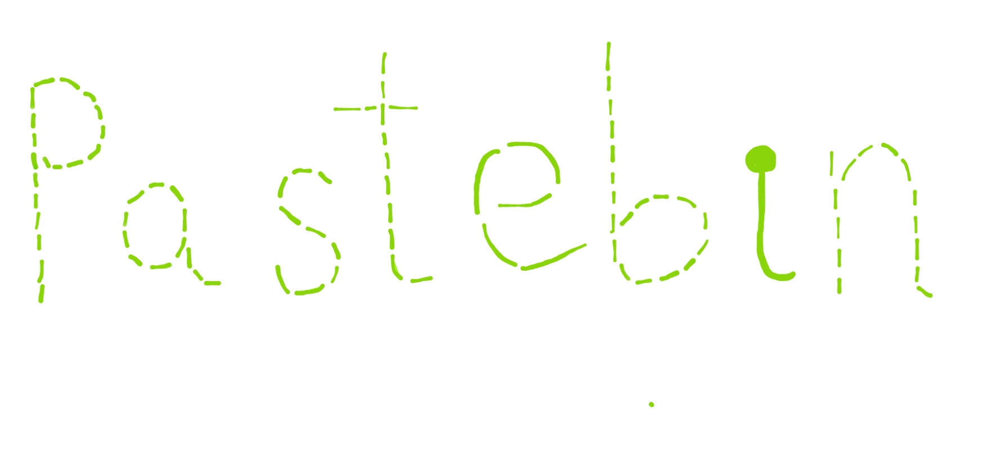

## Description
My virtual kitty got this from some friend on the internet and she won't tell me who :(

## Given Files

## Solution
The image spelled "pastebin" which meant the flag had something to do with pastebin website.

Upon closer inspection, each letter had different number of lines (got this clue because of letters 'e' and 'i', they had too little lines as compared to others, so thought this could be some sort of clue)

	P - 19 lines - letter 's'
	a - 12 lines - letter 'l'
	s -  9 lines - letter 'i'
	t - 13 lines - letter 'm'
	e -  5 lines - letter 'e'
	b - 19 lines - letter 's'
	i -  1 line  - letter 'a'
	n - 14 lines - letter 'n'

So, now I had 2 clues "pastebin" and "slimesan"
Found this [page](https://pastebin.com/u/slimesan) on pastebin.
Found this string in their pastes - **}23N1l_n1_n3dd1h{kcaHannaW**
Which is clearly the flag in reverse.

## Flag
WannaHack{h1dd3n_1n_l1N32}
