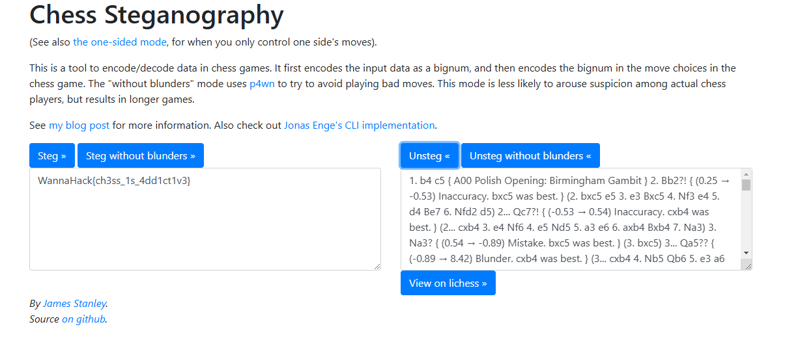

## Description
i found this random [game](https://lichess.org/6Z9VSdpu) on lichess between 2 people. why are they playing so badly. tch tch absolute dogshit.

## Solution
I searched for "Chess Steganography" on the web and found a [website](https://incoherency.co.uk/chess-steg/) decoding data from "Chess Game PGN"

## Flag
WannaHack{ch3ss_1s_4dd1ct1v3}
