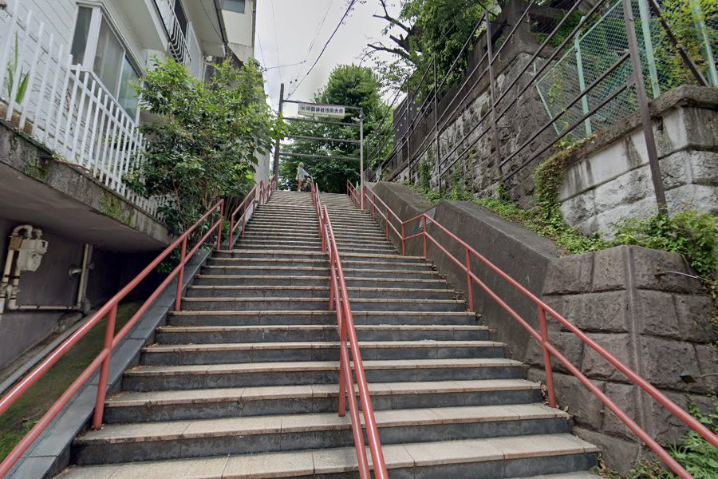
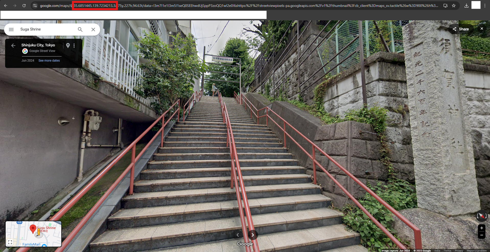

## Description
This is the **first part** of the Geo OSINT challenge.

Your task is to locate the exact coordinates (up to 6 decimal places) of the image provided.

Once you've found the location, wrap the findings in the Flag format: `WannaHack{latitude_longitude}`.

Eg. If the coordinates are 55.334546, 20.123321, the flag will be WannaHack{55.334546_20.123321}

## Given Files

## Solution
Upon using Google Lens on the given image, I found out that it is Suga Shrine.

I opened the place in google maps street view and found the exact location.

The red box gives the latitude and longitude of the place.

## Flag
WannaHack{35.685144_139.723421}
