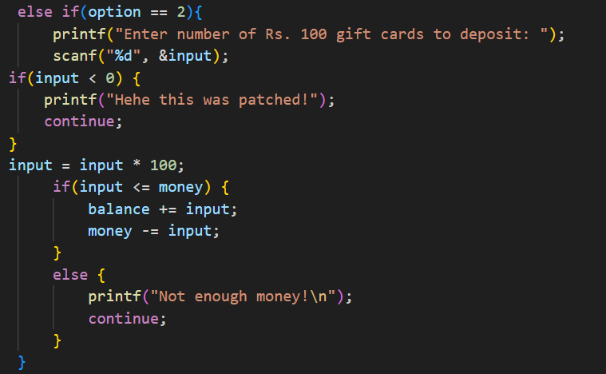
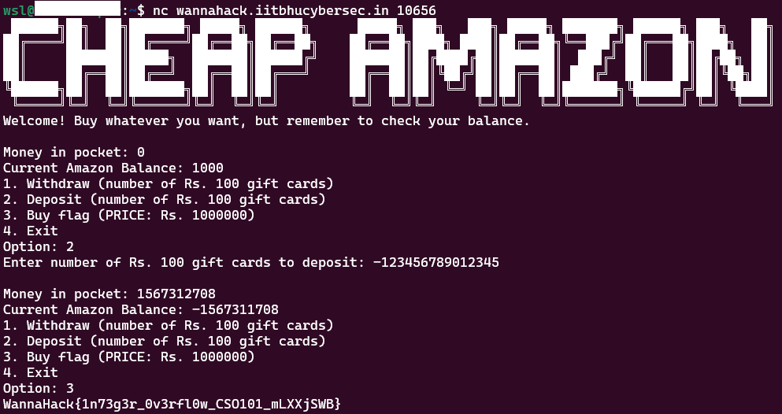

## Description
Turns out you broke my Amazon :(
Now worries I built a stronger one hahaha

## Given Files

## Solution
Upon analyzing the given file, I found this code.

All conditions were patched but Integer Overflow could still work as the code is in "C" language which has hardcoded limits.
Integer Overflow - It happens when a number exceeds the maximum or minimum limit of the integer data type being used. 

With the same logic used in "Cheap Amazon" challenge, I had to deposit a negative number to increase the money in my pocket.

Minimum Integer Limit = -2^31
If I input a number less than this limit than, even though the number is negative, it is perceived as a positive number by the conditional statement. Thus, bypassing the conditions and getting enough money to buy the flag.

## Flag
WannaHack{1n73g3r_0v3rfl0w_CSO101_mLXXjSWB}
