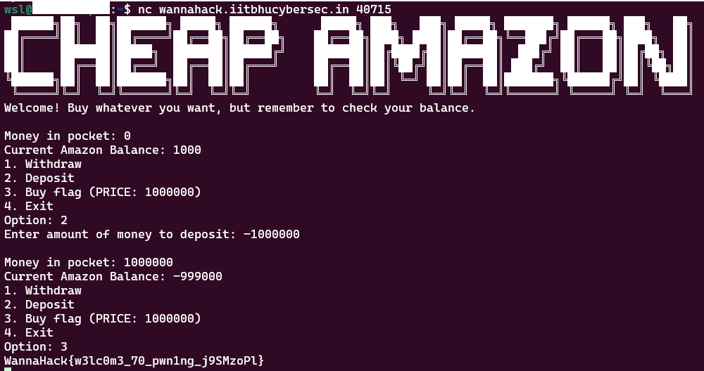
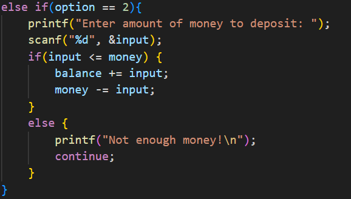

## Description
Made a cheap looking amazon. The prices though may not be cheap :)

## Given Files

## Solution

Upon analyzing the code in the given files, I came across this condition

There is no lower limit to the condition, that is you can Deposit a negative number.

	Money in pocket = Money in pocket - Deposit
	eg -
	Money in pocket = 0 - -1000000
	Money in pocket = 1000000

When you deposit a negative number, the "Money in pocket" increases by the absolute of that number.

Now, I have sufficient money to buy the flag.

## Flag
WannaHack{w3lc0m3_70_pwn1ng_j9SMzoPl}
