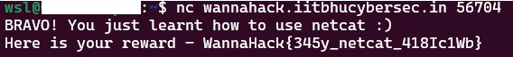

## Description
Have you ever used netcat? Don't worry, just put the `nc` command you get on starting instance on your terminal and see the magic!

## Solution
Just followed the description.

## Flag
WannaHack{345y_netcat_418Ic1Wb}
