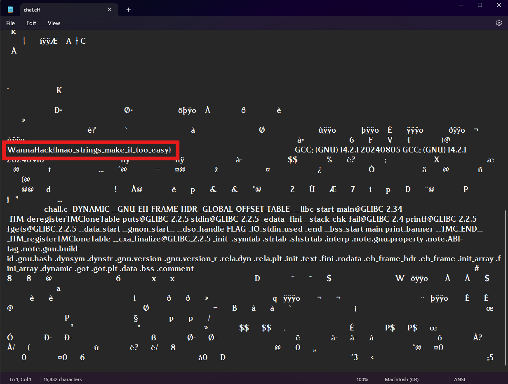

## Description
Can you get the password? Or do you need even to?? 👀

## Solution
Used [toolsley](https://www.toolsley.com/file.html) to find the given file format. 
The given file was ELF.

Opened the file in notepad and found the flag.

## Flag
WannaHack{lmao_strings_make_it_too_easy}
