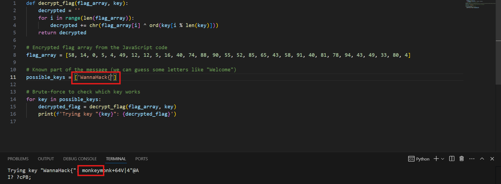

## Description
I found this messy javascript somewhere...have fun understanding it :)

## Given Files

## Solution
The description hints at messy. 
So I asked ChatGPT to simplify this code.

Used this code to bruteforce and find the key.

Upon analyzing the simplified code I realized that the flag and the key can be used interchangeably and since I know that the flag will be of the form "WannaHack{".
I used it as the possible key, the code in return gave me the actual key - **monkey**

When I ran the code again, this time with "monkey" as the possible key, it gave me the flag.

## Flag
WannaHack{M355Y_08FU5C473D_J5}
