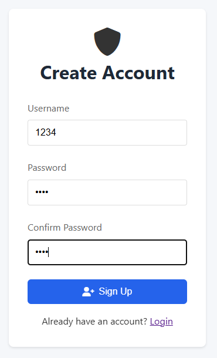
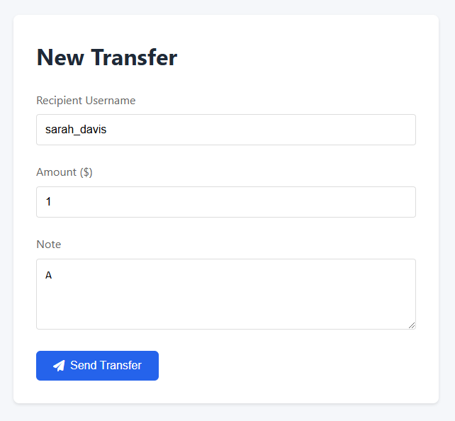
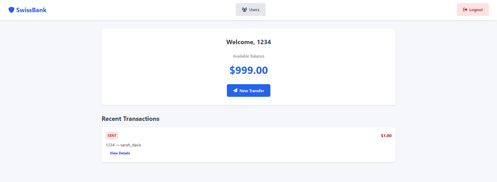
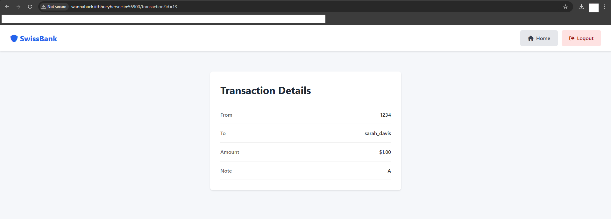
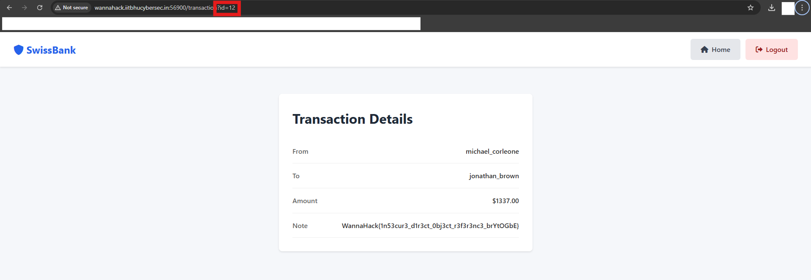

## Description
Inspector Chingum is hot on the trail of Michael Corleone, who recently ordered a hit through his SwissBank™ Account. The transaction note contains crucial evidence, but the bank's legendary privacy policies are hampering the investigation.

The police have gathered some intel:

- Michael Corleone's username is michael_corleone
- The hitman's username is jonathan_brown
- The transaction note contains the secret information

Can you help Inspector Chingum solve the case?

Note: Don't try to bruteforce the auth system, as it will alarm the bank's security system. (outside the story, it will also count as attacking competition infrastructure, and get you banned)

## Solution
Sign Up with a random account and then login with that account.

We need to somehow get to the transaction note, that is we need to somehow find that transaction page.

To get to the transactions page, I transferred some money to a random user.

Now I am able to view my transactions.

Upon opening my transaction I was lead to this page.

In the URL of this page, I could see the transaction page id. Since it was not some cryptic string but simply 13, that meant all the previous transactions were numbered 1 through 12.

I found the transaction page of Michael Corleone on id=12

I found the flag in the Transaction Note on the above page.

## Flag
WannaHack{1n53cur3_d1r3ct_0bj3ct_r3f3r3nc3_brYtOGbE}
