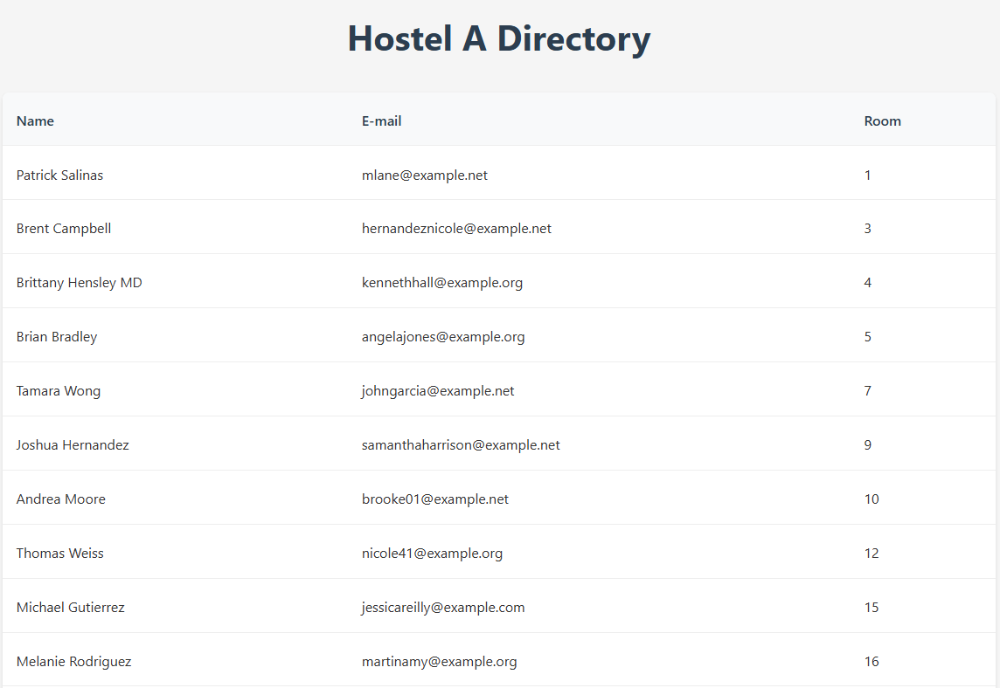
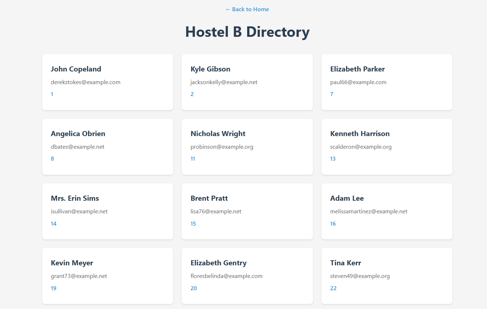
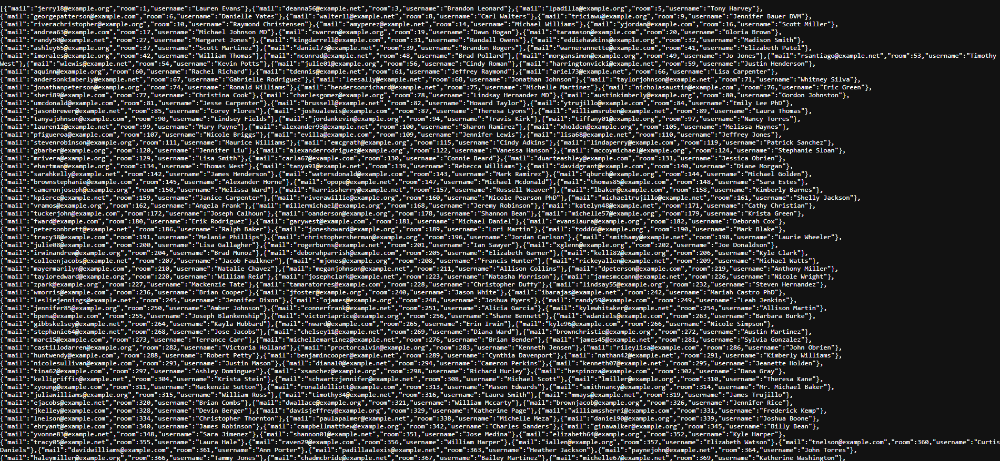
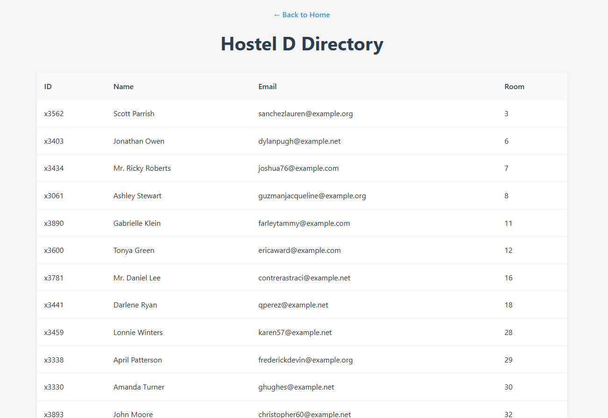
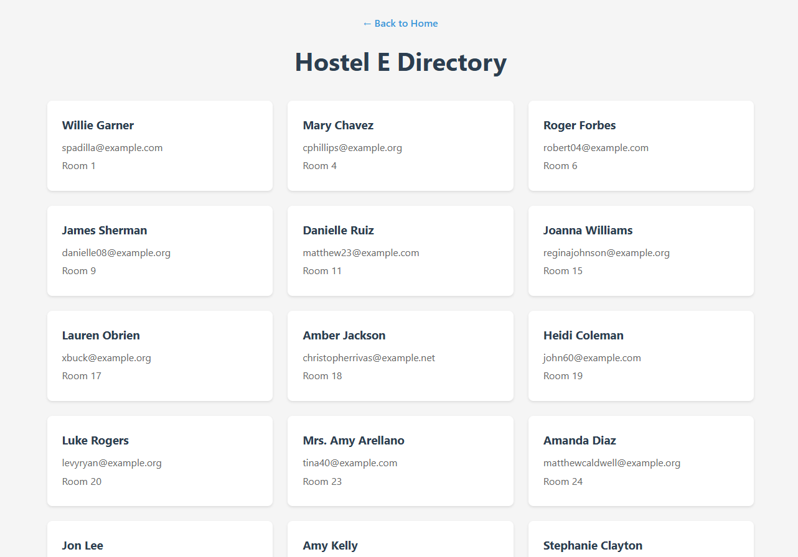
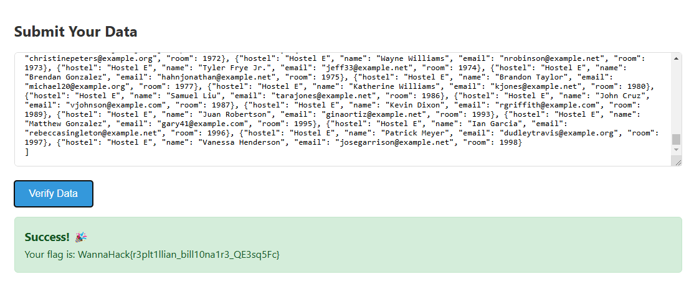

## Description
So I was recently rewatching "The Social Network" (you can find it on Netflix'''). Anyway, Mark Zuckerberg decides to create a website called FaceMash, and for that, he needs Facebook images from multiple dorms. Naturally, he writes a script to grab data from all over the campus network.

He gets into a lot of trouble, ignoring that and do the same thing, scrape the data of each hostel, merge into one, and submit it on the verification page, that will give you the flag.

'''or you can just sail the high seas, or maybe just [youtube](https://www.youtube.com/watch?v=MIIPn95YYHs)

## Solution
The challenge was of scraping data from 5 different hostel pages and submit it in a particular format to get the flag.

For Hostel A
The data was in tables

This is the code I used to scrape data from Hostel A

For Hostel B
The data was in cards

This is the code I used to scrape data from Hostel B

For Hostel C
The data was in the following form

This is the code I used to scrape data from Hostel C

For Hostel D
The data was in the following form

This is the code I used to scrape data from Hostel D

For Hostel E
The data was in the following form

The page has lazy loading so I changed my code accordingly.

This is the code I used to scrape data from Hostel E

After that I compiled and submitted the data in the portal and received the flag.

## Flag
WannaHack{r3plt1llian_bill10na1r3_QE3sq5Fc}
